# Schedule Manager

근무 스케줄을 등록·조회하고, 직원의 근무 변경 요청을 관리하는 웹 서비스입니다.

## 주요 기능

- 캘린더 기반 근무 스케줄 조회 (월/일별, 직원 필터링)
- 직원 관리 (직원 목록/상세)
- 근무 변경 요청 생성 및 처리
- 연락처(비상 연락망) 관리
- 로그인 / 비밀번호 변경

## 기술 스택

- **Framework**: Next.js 15 (App Router), React 19, TypeScript
- **Auth**: next-auth
- **Database**: PostgreSQL, Drizzle ORM (로컬: docker-compose, 운영: Neon)
- **State**: Zustand
- **Validation**: Zod
- **Style**: Sass Modules
- **Test**: Jest, Playwright (E2E는 Testcontainers로 자체 Postgres 기동)

## 시작하기

```bash
# 로컬 DB 실행
docker compose up -d

# 의존성 설치
npm install

# DB 마이그레이션 & 시드
npm run db:migrate
npm run seed

# 개발 서버 실행
npm run dev
```

## 스크립트

| 명령어 | 설명 |
|---|---|
| `npm run dev` | 개발 서버 실행 |
| `npm run build` | 프로덕션 빌드 |
| `npm run lint` | 린트 검사 |
| `npm run typecheck` | 타입 검사 |
| `npm test` | 단위 테스트 (Jest) |
| `npm run test:e2e` | E2E 테스트 (Playwright, 최초 1회 `test:e2e:install` 필요) |
| `npm run db:generate` \| `db:migrate` \| `db:push` \| `db:studio` | DB 마이그레이션 관리 |
| `npm run seed` | 시드 데이터 생성 |

## 기능별 화면

### 로그인

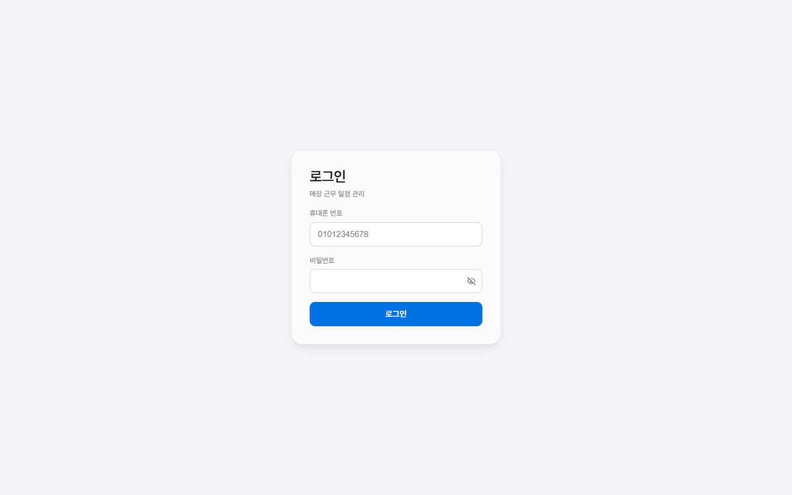

### 캘린더 (월별 / 일별)

| 월별 | 일별 |
|---|---|
| 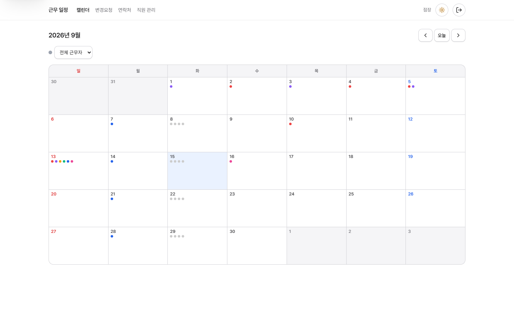 | 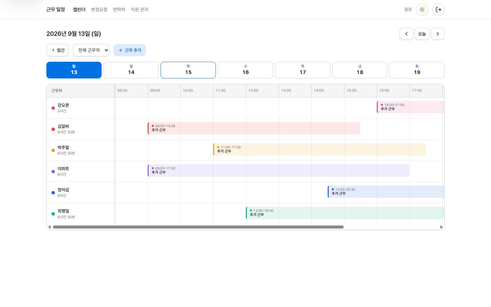 |

### 직원 관리

| 목록 | 상세 |
|---|---|
| 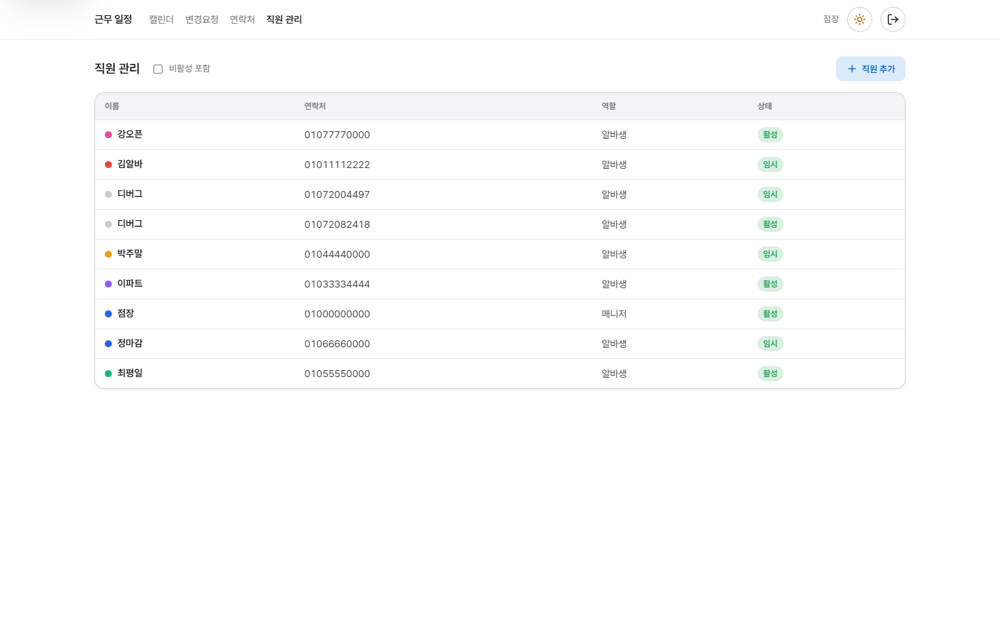 | 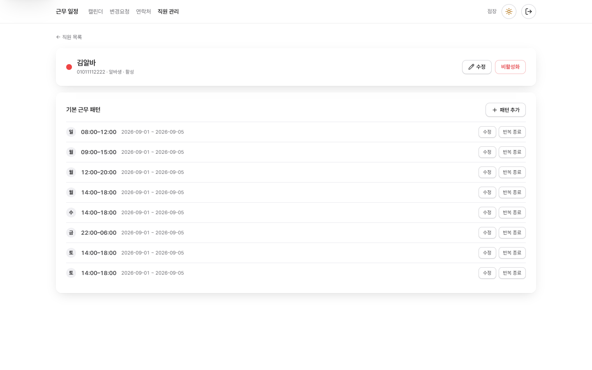 |

### 변경요청

| 목록 | 상세 |
|---|---|
| 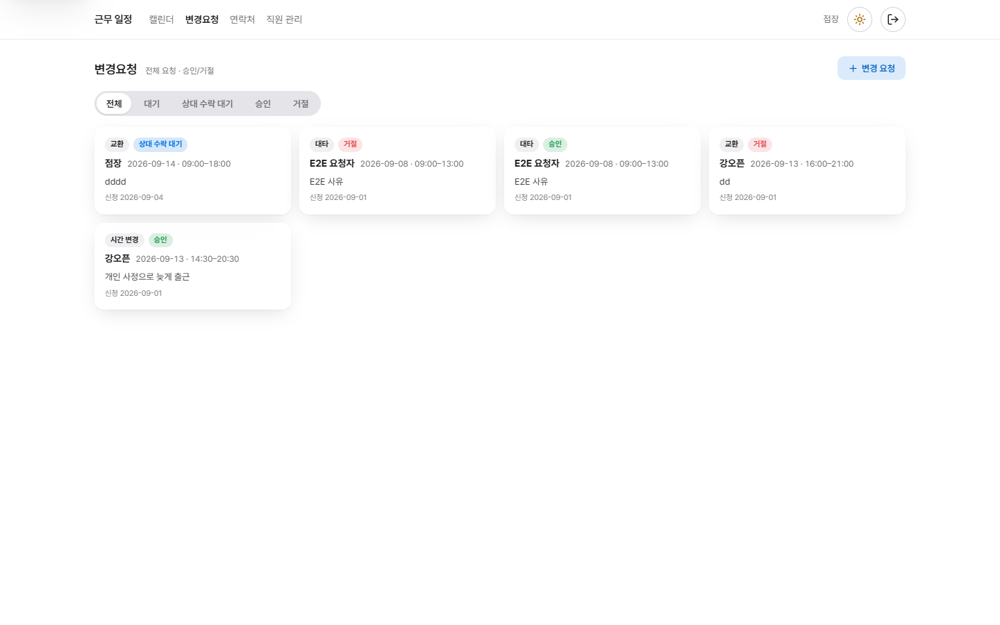 | 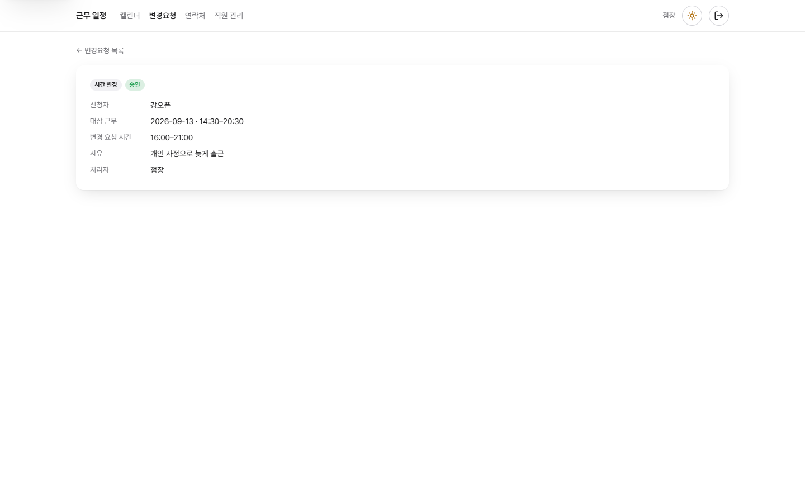 |

### 연락처

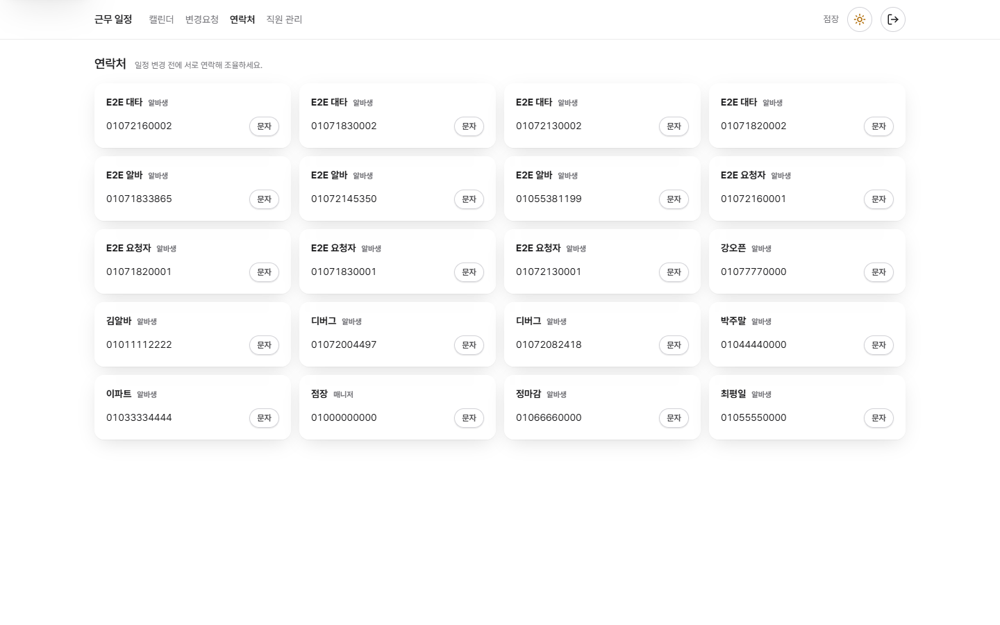

### 모바일

| 캘린더(월별) | 캘린더(일별) | 직원 관리 |
|---|---|---|
| 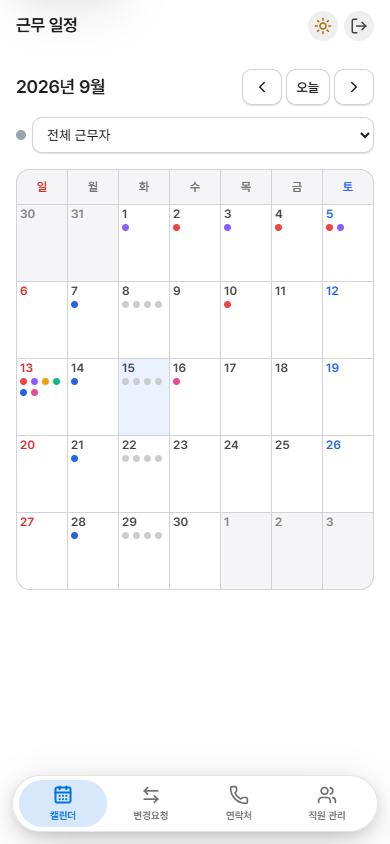 | 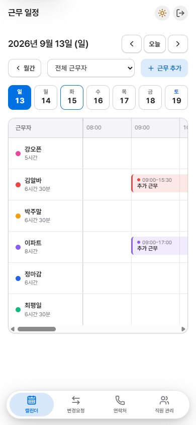 | 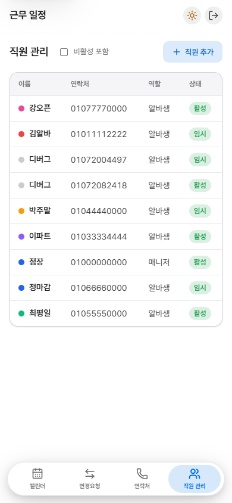 |
